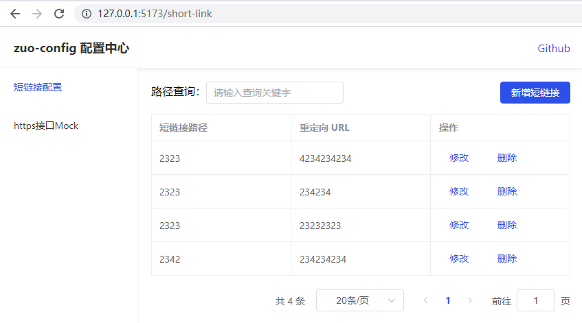
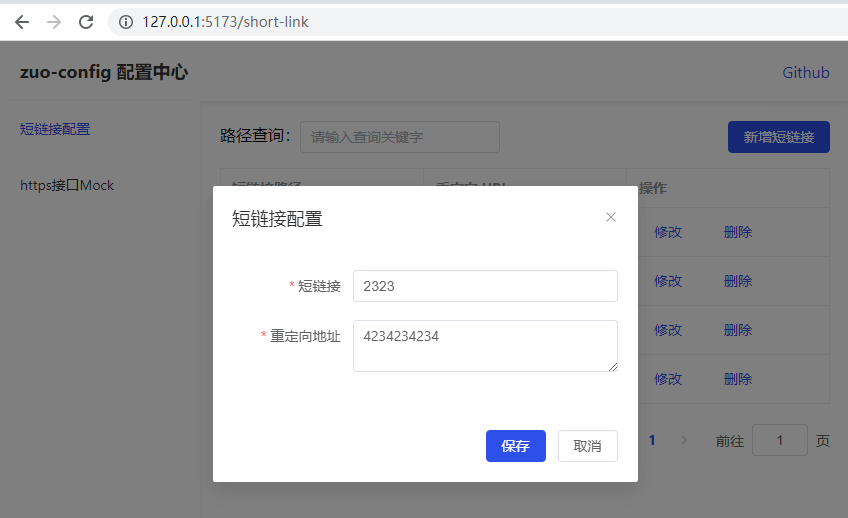
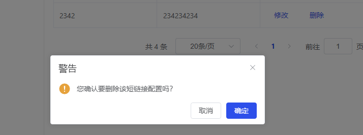
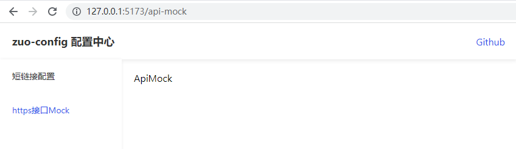

# fe-framework-study

用不同的前端开发框架开发同一个功能 10 次，框架入门练手小项目

[我用不同的前端框架开发一个功能10次--哪个才是最好的JS框架呢](https://www.bilibili.com/video/BV1hM411F7iN)

这个项目内容比较少，不包含 UI 框架/接口请求功能，想着用之前做的配置中心功能，来做学习框架的练手项目

## 功能介绍

配置中心-短链接管理（增删改查/分页/新增修改弹窗/模糊查询/防抖）

### 前端页面功能

短链接配置列表，支持模糊查询、分页

短链接新增、修改

短链接删除

其他菜单页面

### 对应后端接口项目

Koa + MongoDB 实现，仓库：[zuo-config-server v0.1.0](https://github.com/zuoxiaobai/zuo-config-server/tree/0.1.0)

接口列表(都支持跨域)

- 获取配置列表 GET /shortLink/list?t=1673710063475&queryText=模糊查询参数&currentPage=1&pageSize=20
- 新增配置 POST /shortLink/add  参数：{ redirect: "23232323", shortLink: "2323" }
- 修改配置 POST /shortLink/edit 参数：{ _id: "63bee1d8c0351e3aa068e124"， redirect: "23232323", shortLink: "2323" }
- 删除配置 POST /shortLink/del 参数：{ _id: "63bee1d8c0351e3aa068e124" }

## 用不同前端框架实现该功能

### vue3+ts+vite+ElementPlus+sass+axios

实现代码地址：[zuo-config-fe v0.1.0](https://github.com/zuoxiaobai/zuo-config-fe/tree/0.1.0)

在线体验地址：[config.zuo11.com](http://config.zuo11.com)
